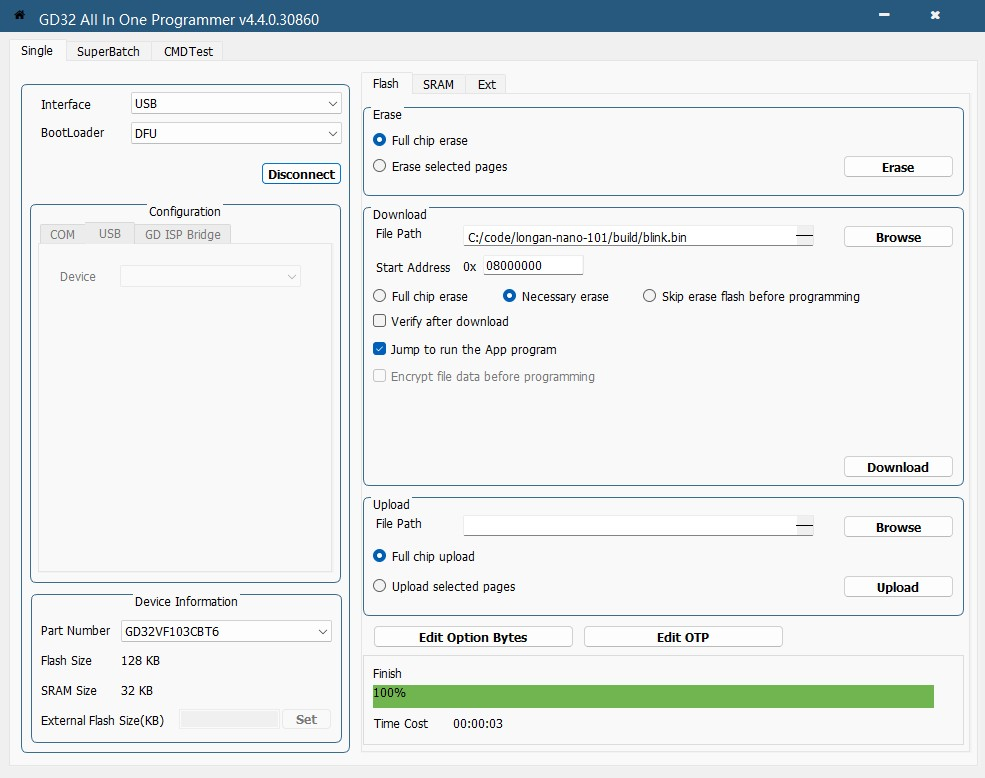

The Longan nano is a board that contains a RISC-V [GD32VF103CBT6](https://www.gigadevice.com/product/mcu/main-stream-mcus/gd32vf103-series). Also have a RGB led,
TFT Display connector and an SD card reader.

## Setup
### Windows

#### DFU
You need to download the [GD32 Dfu Drivers](https://www.gd32mcu.com/download/down/document_id/244/path_type/1) and the [GD32 All-In-One Programmer](https://www.gd32mcu.com/download/agree/box_id/12/document_id/245/path_type/1)

In the GD32 All-In-One Programmer you need to select **Interface**: `USB` and **BootLoader**: `DFU`. 
In the **Download** you need to select the bin file and on the board you need to press `Reset` and `Boot0` buttons 
and later release the `Boot0` button to start in the `DFU` mode

## Links
- [Schematic](https://doc.nucleisys.com/nuclei_sdk/design/board/gd32vf103c_longan_nano.html#schematic)
- [Product Page](https://wiki.sipeed.com/hardware/en/longan/Nano/Longan_nano.html#User-Guide)
- [GD32VF103 Manual](https://www.gd32mcu.com/data/documents/userManual/GD32VF103_User_Manual_Rev1.7.pdf)
- [GD32VF1 Downloads](https://www.gd32mcu.com/en/download/7?kw=GD32VF1)
- [GD32 Dfu Drivers](https://www.gd32mcu.com/download/down/document_id/244/path_type/1)- [GD32 All-In-One Programmer](https://www.gd32mcu.com/download/agree/box_id/12/document_id/245/path_type/1)
